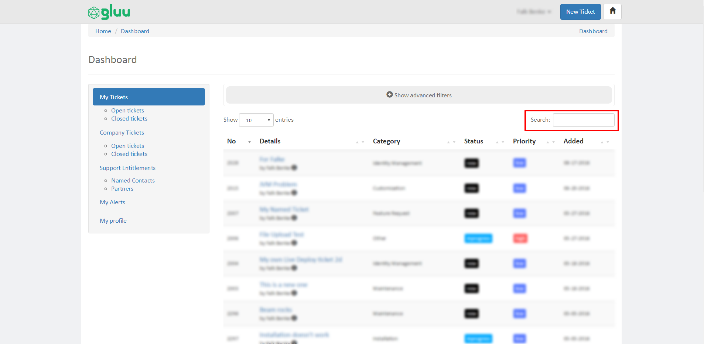

# Support Portal User Guide

The Gluu support portal is designed to be a community knowledge base, as well as a support solution for Gluu customers. 

Anyone can browse and open public tickets on Gluu Support. Gluu customers can create private tickets, share tickets with colleagues, and will receive priority assistance from Gluu's support staff. 

## User Roles and Privileges

Community: Community users can open public tickets and browse existing public tickets. Responses from Gluu support are not guaranteed, but we do our best to respond in a timely manner. 

Named Contact (customer): Named Contacts can open private tickets for their organization, share tickets with colleagues, schedule support and consultative calls, upload files to tickets, and expect faster responses and more detailed assistance from Gluu support.

Admin Contact (customer): Account Admins are primary contacts for the customer. They have all the privileges of a Named Contact, plus the ability to add and remove named contacts from their organization. In addition, they can authorize certified Gluu partner organization's to interact with Gluu support on their behalf (if necessary).

## Search 

### Front-end
You can use the front-end global search to find existing public (or your organization's private) tickets that may be related to your question. As you type, predictive search results are displayed to help you find existing relevant content. If you are looking for a ticket regarding a specific topic, such as integrations, you can also select a category to search within to narrow down results. Once you click the search button, results will be displayed in a list. You can sort the search results by any of the columns. 

### Back-end 
As a registered user on the support portal you will have access to your own dashboard. From within the dashboard you can search, sort, and filter tickets created by (or on behalf of) yourself. If you are associated with a customer organization, you can also search, sort, and filter your colleagues public and private support requests.

## Advanced Filters

Advanced filters allow you to filter your tickets and your colleagues tickets (if applicable) by one or more attributes, for instance by ticket status, priority, or date of creation. In order to use advanced filters navigate to your user dashboard and click the "Show advanced filters" menu bar. This will expand the menu and display available filters. Select the applicable filters, and click the "Filter" button to perform your search.

## Submitting Tickets

You must be signed in to submit support requests.

> The new ticket form may display less fields than those described in this section. The fields you see will depend on whether you have a free, paid, or partner account.

1. New ticket: Click the New Ticket button at the top right of the page.

2. Create ticket on behalf of: If you are associated with a certified Gluu Partner organization, and have been granted access to a Gluu customers support account, you can use this field to associate a new ticket with the appropriate customer organization and person. First select the customer account you are opening the ticket on behalf of, and then select the appropriate user to create the ticket for. 

3. Gluu Server Version: Select which version of the Gluu Server you are inquiring about so that we can better understand the issue.

4. Which OS are you using?: Select the appropriate OS to let us know more about the server you deployed Gluu on. 

5. Is it 64-bit hardware?: This is a minimum requirement for all Gluu Server deployments. Please confirm that your server is using 64-bit hardware. 

6. Does the server have at least 4GB RAM? This is a minimum requirement for all Gluu Server deployments. Please confirm that your server has at least 4GB RAM. 

7. Issue Type: Let us know what type of issue you are experiencing. 

8. Category: Categorize the issue as appropriate. 

9. Title: Enter a descriptive ticket title.

10. Description: Enter a description of your issue or question. If you're experiencing what you think may be a bug, please include all relevant details for us to reproduce. 

11. Privacy: Set the ticket privacy to either public or private. If the ticket is private, only you, your colleagues, and any associated partners will be able to see the ticket. Public tickets are publicly viewable. By default new tickets created by customers and partners are marked as private. 

12. Link URL: If you have any supporting details hosted on another site, like pastebin, include a link to the supporting information.

13. Send copy to: To cc colleagues or partners, enter their email address here and use a comma to separate each email address.

14. Attachment: Upload files for any additional supporting information like logs. 

15. Submit your ticket!

> Use our guide to learn [how to create a good ticket](./how-to-ask.md) on Gluu Support.

## Responding to existing tickets

Users can update an existing support request by commenting on a ticket. 

1. Navigate to the ticket you want to update.

2. Insert your response in the text field.

3. Review the ticket's privacy setting. If you'd like to keep the same privacy settings as the previous response, leave the value as `Inherit`.

4. If you have supporting documents to include in your response, you can insert a link or attach a file (customers and partners only).

5. If you'd like one or more colleagues to be notified of your response, include their email(s) in the `Send copy to` field. Separate multiple multiple email addresses with a comma. 

## Closing Tickets 

If your issue has been resolved, you can close the ticket by clicking the Close button in the left hand menu.  

### Creating a follow-up to a solved request

You can comment on or reopen a closed ticket, or create a new ticket that references the former ticket. 

## Tracking Tickets

### Tracking your tickets

You can use the Support Portal Dashboard to track your support requests.

1. Click your profile icon on the upper-right side of any page, and then click My Dashobard. By default, the page displays all requests that you have submitted. 

2. To see a filtered view of all your open requests, click the Open tickets link in the left-hand menu.

3. To see a filtered view of all your closed requests, click the Closed tickets link in the left-hand menu.

4. To see details about a request, hover your mouse over the info icon next to your name. 

5. To search your tickets, use the search bar in the right hand corner. 

6. To sort tickets by one of the table categories, simply click the arrow once or twice.

7. To further refine tickets, you can expand the advanced flters dropdown.

### Tracking your organization's tickets 

*Customers & Partners only*

If you're a member of a Gluu customer organization, you can see tickets for all other members of that organization. 

> Supported Gluu customers have a limited number of "named contacts" that can interact with Gluu staff for support. The Basic support plan includes 4 named contacts, Premium includes 6 named contacts, and Enterprise includes 8 named contacts.

1. Click your profile icon on the upper-right side of any page, and then click My Dashobard. By default, the page displays all requests that you have submitted. 

2. Using the left-hand menu, navigate to the "Company Tickets" section. 

3. To see details about tickets, and to search, sort, and filter tickets, follow the [above instructions](#to-track-your-support-requests). 

### Tracking your customer's tickets 
*Partners only*

If you're a member of a Gluu partner organization, and a Gluu customer has granted you access to their tickets, you can view their tickets in your dashboard. Once a Gluu customer grants your organization's access to their tickets, you'll see a section in the left-hand menu of your Dashboard that specifies "Partner Companies" with a specific link for each customer organization that has given your organization access to their tickets.

## Notifications 

Each ticket is subject to its own notifications. If you are the ticket creator you are automatically subscribed to those notifications. If you wish to receive notifications, or stop receiving notifications for a specific ticket, navigate to the ticket in question and click the blue button that either says `Send me alerts` or `Remove me from alerts` depending on your existing alerts setting.  

### View all notifications you are subscribed to

You can view all the tickets that you are subscribed to from the Dashboard > My Alerts section. To remove yourself from a tickets notifications simply navigate to the ticket and click the `Remove me from alerts` button. 

### Subscribe to all organization notifications

If you are associated with a Gluu customer organization and would like to receive notifications for all tickets related to your organization, you can navigate to `https://support.gluu.org/dashboard/my-profile/` and tick the box for `Subscribe to notifications for tickets created by your colleagues`, as shown in the picture below. Click save to update your preferences. 

## Managing Named Contacts 
*Customers & Partners only*

If you are the lead point of contact at a Gluu customer organization (a.k.a. the Account Admin), you have the ability to add and remove your colleagues as supported contacts. Named contacts can open private tickets, share tickets with colleagues, schedule support and consultative calls, upload files to tickets, and expect faster responses and more detailed assistance from Gluu support.

Named contacts are limited based on the support plan your organization has purchased from Gluu. 

|Basic Support|Standard Support|Premium Support|Enterprise Support|
| ------------- |:-------------:|--------:| -----:|
|2|4|6|8|

For a complete overview of support entitlements see the [Gluu support matrix](http://gluu.org/entitlements). 

You can manage named contacts at: [https://support.gluu.org/dashboard/company-users/](https://support.gluu.org/dashboard/company-users/). 

### Adding Named Contacts
In order to add a colleague to the list of named contacts, simply enter the persons email in the `Invite via Email` field. Click the `Submit` button and the person will receive an email invitation to join your organization's account on Gluu Support. If the person already has an account on Gluu Support, their account will be upgraded upon their next login. 

### Removing Named Contacts
There are two ways to remove existing Named Contacts from your organization:

1) Make Basic User: this downgrades the user's role from a Named User to a regular User. The user will no longer be able to see and open tickets on the company's behalf, their tickets will no longer be subject to the SLAs in the support contract, and they will lose the ability to create private tickets and upload attachments. They will go back to being a community user on Gluu Support. 

2) Deactivate Account: this will completely deactivate the users account. If the user tries to login to Gluu support using this account they will get a page that tells them their account has been deactivated. 

Of the two options, deactivating the account is more severe and should be used when the user in question should no longer have an account associated with the customer organization. 

To manage named contacts for your organization, login to the support portal and visit [https://support.gluu.org/dashboard/company-users/](https://support.gluu.org/dashboard/company-users/).

## Managing Admin Contacts

Each customer organization should delegate one or more people to act as their Gluu Support account admin. An accound admin has all the privileges of a named contact plus the ability to manage named contacts and authorize certified Gluu Partner organization's to interact with their private tickets (as necessary).

If at any point in time the admin privilege needs to be shifted, or if your organization wants multiple people to have admin contact privileges, the existing admin contact can make any other named contact an account admin via the Mange Users page in the support dashboard. 

Simply navigate to `https://support.gluu.org/dashboard/company-users/`, and click the "Make Account Admin" link for the appropriate user. The next time they sign in they will have admin contact privileges. 

If the existing account admin should be removed, they can transfer admin privileges to another named contact and the new account admin can then remove the users admin status, and deactivate or downgrade the user as necessary. 

## Managing Partner organizations 
*Customers & Partners only*

If you are the Account Admin, you have the ability to add and remove certified Gluu partners from your account. Certified Gluu partners are organizations that have been vetted by Gluu, and engaged by your organization to assist with your Gluu server integrations and operations.

Adding a certified partner organization will enable all authorized contacts at the partner organization to see your organizations private tickets, and to create tickets on behalf of you and your colleagues. This will allow you to more seamlessly work with partner organizations and Gluu support to resolve issues relating to your authentication and authorization service. 

## Book Meetings
*Customers & Partners only*

Support and review calls are included with all VIP support contracts. To schedule a call with Gluu navigate to the Book Meetings section of your Gluu support dashboard. If you'd like help troubleshooting a specific implementation issue, book a support call. For high level security reviews, design discussions, etc., book a review call. To book meetings, login to the support portal and visit [https://support.gluu.org/company-booking/](https://support.gluu.org/company-booking/). 

