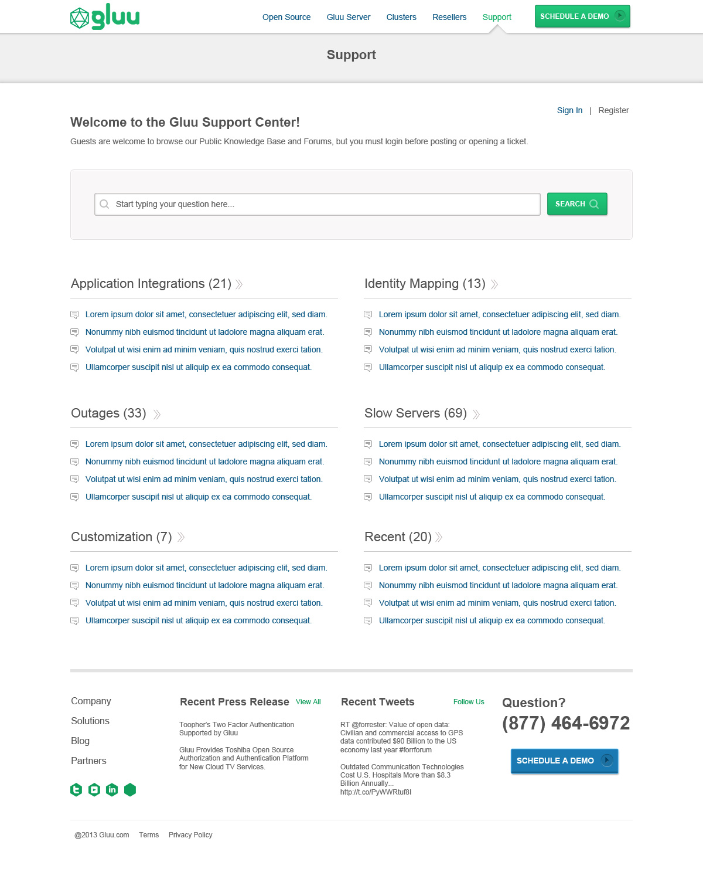
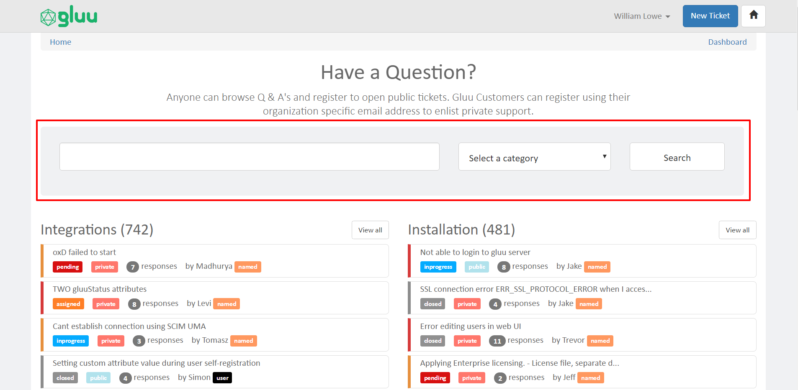
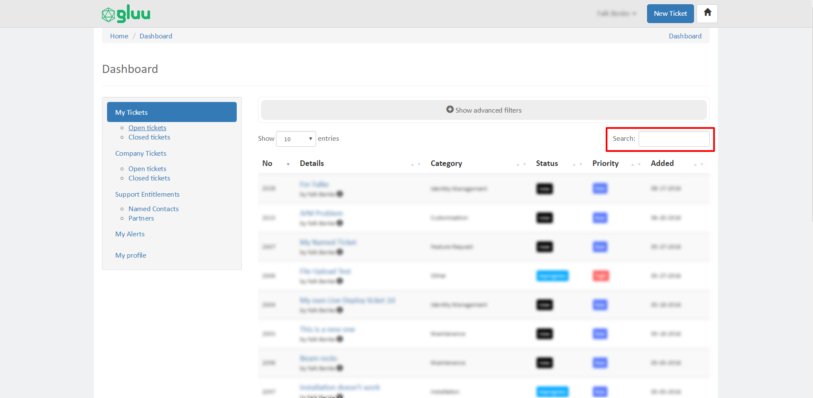
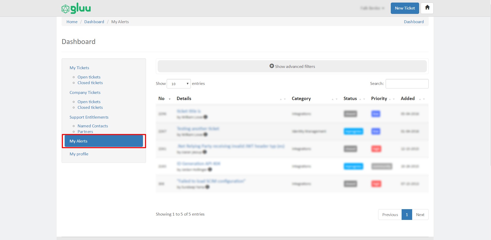
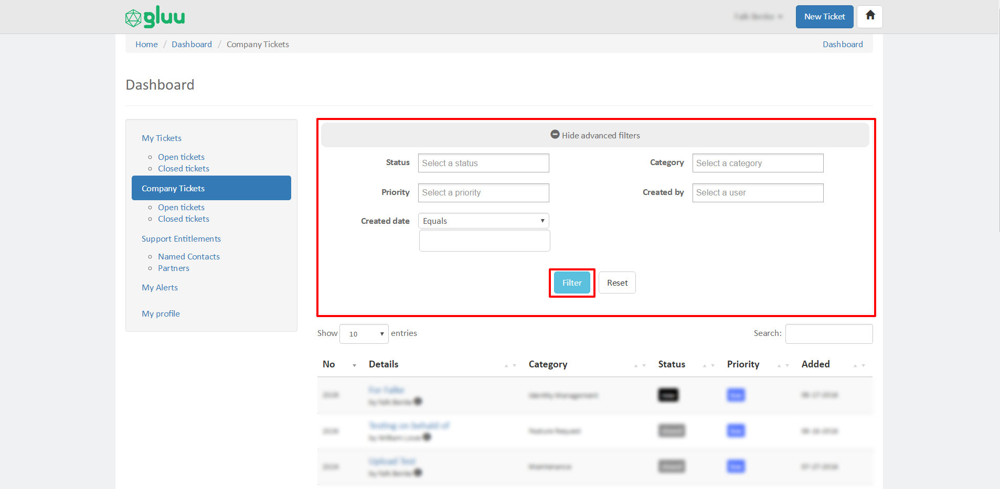

[TOC]

# Gluu Support User Guide

# Roles 
There are five types of users on Gluu Support:          

- Community Users: Any user without a paid Gluu support contract. Community users can open public tickets. Responses from Gluu support are not guaranteed, but we do our best to respond in a timely matter.           

- Named Users: Users associated with an organization that has paid for a Gluu support contract. Named users can open private tickets, share tickets with colleagues, upload files to tickets, set ticket priority, and expect faster responses and more detailed assistance from Gluu support.         

- Customer Account Admins: This is the primary contact from the customer organization. Customer Account Admins have all of the privileges of a Named User, plus the ability to add / remove named contacts from their organization as well as authorize people from certified Gluu Partner organization's to see their private tickets (if necessary).            

- Partners: Certified Gluu service partners that are able to help Gluu customers with Gluu Server operations, integrations, customizations, etc.        

- Staff: Gluu staff users.     
  
# Homepage
The homepage of the Gluu Support Portal organizes tickets into categories such as integrations, installation, maintenance, etc. On each ticket listing you can see the ticket creator, whether the ticket is open or closed, and how many responses the issue has generated. The tickets that are displayed depend on your user role. If you are a supported customer or partner, the homepage will also include private tickets created by you or one of your organizational colleagues. 

# Registration
Registration is fairly straightforward. One thing to note is that if you are associated with a supported organization, please use your organizational email address during registration. This will ensure that your user has the proper permissions. 

# Login 
The Gluu Support Portal utilizes our own Gluu Server for login. If you have any trouble logging in, please send an email to [support@gluu.org](mailto:support@gluu.org)

# Front-End Search
Using the front-end search located on the homepage, you can find and review existing public or private tickets that may be related to the issue or question for which you are seeking assistance. Searches can be performed against all available tickets in the database, or you can search for tickets within a specific category.

# Opening Tickets
After successfuly registering an account you can open tickets on Gluu Support. Markdown formatting is supported. If you need to learn how to properly format in Markdown, you can review this [Markdown guide](http://dillinger.io/). Depending on your user role, you will be able to enter information for some or all of the following ticket fields. 

Read our guide to learn [how to create a good question on Gluu Support](./how-to-ask.md).

## All users (required fields)

- Gluu Server version
- Operating system in use
- Confirm that 64-bit hardware is being used
- Confirm that the server has at least 4GB RAM
- Ticket title
- Ticket description
- Ticket category

## All users (optional fields)

- Link URL: Can be used to provide a link to supporting documents, such as logs and screenshots.    
- Send a copy to: Can be used to notify a colleague about your new ticket or response. 

## Named Partner, & Staff users (required fields)

- Status  
- Priority  
- Privacy: By default, all customer tickets are marked as private. This means only you and other named contacts from your organization (or an authorized partner organization) can see and interact with the ticket. If the ticket information is not sensitive and you think it may benefit the Gluu community, you can make the ticket publicly viewable. 

## Named, Partner, & Staff users (optional fields)

- Add up to five attachments 

## Staff & Partner users (optional fields)

- On behalf of: Using this field partners and staff can create a ticket on behalf of a supported organization. Partners can only create tickets on behalf of customer organizations that have authorized them to do so.  

# Responding to Tickets
Markdown formatting is supported. Before submitting your response, you can also adjust certain properties of the ticket such as the status, priority, and more. For information on any of the additional fields, please review the information above on [opening a ticket](#opening-tickets). 

Note: when adding a response, the default value for Privacy is `Inherit`. This simply means that your post will inherit the previous post's privacy value. So if all previous posts in the ticket were marked `Private`, your new submission will also be private. And vice versa if all previous posts were marked `Public`. 

# Dashboard

The dashboard allows you to manage personal and organizational tickets, support entitlements, alerts, and profile information. 

## My Tickets (All users)

You can view, search and refine your open and closed tickets in the My Tickets section of the dashboard. 

## Company Tickets (Named, Partner, & Staff users)

Here you can view, search and refine all tickets associated with your organization. This includes tickets opened by you and tickets opened by other named contacts at your organization and / or your partners organization (if applicable).  

## Partner Companies (Partner users only)

In the Partner Companies section of the dashboard, users from a certified Gluu partner organization can view, search and refine tickets from users associated with a Gluu customer account. Before customer's private tickets are viewable to the partner organization, the customer's Admin Contact must authorize the partner organization's access via the Support Entitlements > Partners section of the Dashboard. 

## My Alerts (All users)

From the My Alerts section of the Dashboard, users can adjust whether or not they receive specific ticket notifications. In order to add or remove yourself from a tickets notifications, navigate to the ticket in question and click the blue button that will either say "Send me alerts" or "Remove me from alerts".  

## My Profile

Add or edit personal information about yourself in the My Profile section of the dashboard. 

# Advanced Filters

In all Dashboard ticket lists, you can toggle the "Show advanced filters" menu in order to refine and sort available tickets. The available filters include: 

 - Status
 - Priority
 - Created date
 - Category
 - Created by (not available for community users) 

